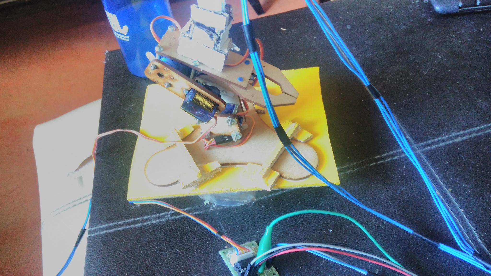
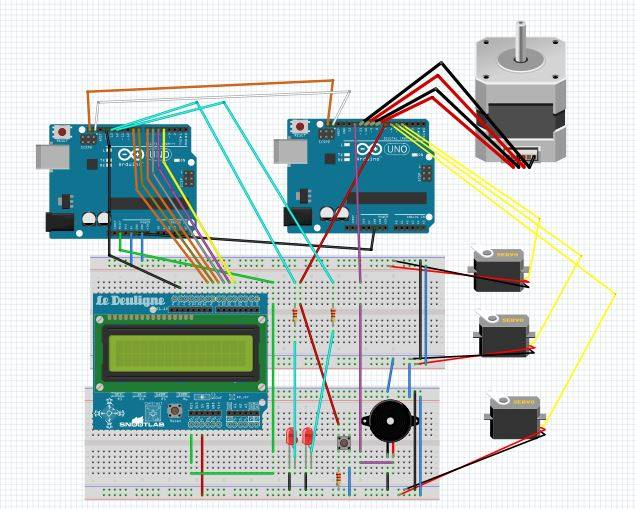
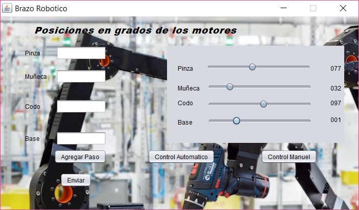

# Brazo robotico
  En el siguiente proyecto  crearemos una brazo robotico con servo motones, motor a pasos y con comunicacion serial hacia
un arduino para manipularlo desde una interfaz en Java.
  Cuando se encuentra en modo manual/automatico se mostrara en un display
  Para lo cual necesitaremos:

* Arduino UNO
* Cables para protoboard
* 2 protoboard
* 3 servo motores
* Display LCD de 16X2 con su placa controladora
* Motor a pasos
* IDE de desarrolla JAVA

Adicionalmente, necesitaremos tener a nuestra disposicion del Java Developer Kit para lograr la programacion en Java.
Ya sea en un IDE (como netbeans, Oracle, etc) o sólo el compilador por consola.

# Importante
Hay que tener en consideracion ciertas librerias que se utilizan para tanto java como el desarrollo en arduino
* JAVA: RXTX Esta libreria nos ayudara en Java con la comunicacion serial.
* Arduino: EEPROM esta libreria se utiliza para escribir/leer la memoria EEPROM incluida en el arduino
* Arduino: SERVO.h esta ibreria nos permite controlar correctamente la funcionalidad de los servos
* Arduino: Wire esta libreria nos ayuda con la comunicacion entre arduinos por el protocolo I2C

## Imagen del prototipo

## Imagen del esquema de conexion

## Funcionalidad
El LCD mostrara en todo momento la modalidad en el que este el brazo S/N (sin escojer ningun modo), MANUAL y AUTOMANICO.
Mediante una interfaz en java se manupulara completamente el brazo, y es el protagonista del funcionamiento del brazo.
se implemento un boton que su funcionalidad es de hacer que se quede en stand by el brazo y al precionarlo de nuevo siga 
con los pasos faltantes en el modo automatico
# Interfaz de java modo manual

se desplegara una ventana mostrando el nombre de cada motor(Pinza, Muñeca, Codo y Base), mediante slayers se seleccionaran
los grados deceas que se movera el servo motor o el motor a paso en caso de que se mueva la Base, la cantidad de grados que se mueve un servo es entre 0 a 180 grados y en el caso del motor a pasos es de 1 a 4, que 2 es una vuelta completa.
# Interfaz de java modo automatico

En este caso no se desplegara una ventana, los textBox que se muestran en la imagen son para el modo automatico, de igual
manera que el manual cada texbox viene especificado para que motor es, los moviemientos se guardaran por pasos, por 
ejemplo: si deceamos abrir, cerrar, abrir la pinza se tendra que ingresar 3 pasos el primero es poner la pinza 180(pinza abierta) 
y dar en el boton de agregar paso, poner 0(pinza cerrada) en la pinza y agregamos paso y volvemos agregar un paso con 180 en la pinza
proceseguimos en darle en el boton enviar y el brazo empezara a ejecutar los pasos ingresados.
* Control Manuel: boton para ingresar al modo manual.
* Control Automatico: boton para ingresar al modo automatico.
* Agregar Paso: boton para agregar los pasos para el modo automatico.
* Enviar: boton que envia todos los pasos guardados al arduino para que los ejecute el brazo.

## IMPORTANTE!!!!
El  codigo java y arduinno no lo anexare en el readme por la cantidad tan grande de lineas que contiene anexare los codigos fuentes.

